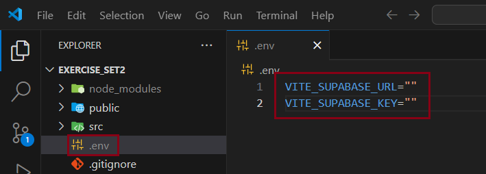

# Pallopeliselainohjelma

## Esivalmistelut
Asenna Node.js-ympäristö ja Visual Studio Code -editorisovellus.

Tee [Supabase-palveluun](https://supabase.com/) käyttäjä ja luo uusi projekti. Varmista sen jälkeen, että projekti on avattuna ja siirry sivuvalikosta Table Editor -sivulle. Paina sivun keskellä olevaa "Create a new table" -nappia. Syötä Name-kenttään "ranking". Täppää "Enable Row Security" pois päältä. Lisää sarakkeet seuraavilla arvoilla:
- Name: id, Type: int8, Primary: täppä, Is Identity: täppä
- Name: created_at, Type: timestamptz, Default Value: now()
- Name: points, Type: int8
- Name: nickname, Type: text


Siirry sivuvalikosta Project Settings -sivulle. Settings-sivun valikosta siirry CONFIGURATION-otsikon alta API-sivulle. Kopioi sivulla olevan Project URL -laatikon sisällä olevan kentän sisältö. Kentän otsikko on URL. Ota kopioitu merkkijono talteen. Kopio sitten Project API Keys -laatikon ensimäisessä kentässä oleva merkkijono. Kentän tag on public. Ota myös tämä merkkijono talteen.

## Ohjelman lataaminen ja riippuvuuksien asentaminen
Avaa komentoterminaali, navigoi kansioon, johon haluat kloonata projektin ja kloona projekti ajamalla seuraava komento:
```
git clone https://github.com/inkaliinalauranto/Exercise_Set2.git
```
Siirry kloonattuun projektikansioon ajamalla komentoterminaalissa seuraava cd-komento. (Jos nimesit projektin muulla nimellä, kirjoita nimi Exercise_Set2-nimen tilalle.)
```
cd Exercise_Set2
```
Aja sen jälkeen komentoterminaalissa seuraava riippuvuudet asentava komento:
```
npm install
```
Avaa projekti Visual Studio Code -editorilla ajamalla komentoterminaalissa seuraava komento:
```
code .
```

## Ohjelman konfigurointi ja käynnistäminen
Paina vasemman laidan tiedostopuun .env_example-tiedoston kohdalla näppäintä "F2" ja vaihda nimeksi ".env". Paina enter-näppäintä nimen syöttämisen jälkeen, jotta tiedoston nimi päivittyy.



Aseta VITE_SUPABASE_URL-muuttujassa olevien lainausmerkkien sisään ensimmäiseksi tallettamasi URL-osoitteen muotoinen merkkijono. Aseta VITE_SUPABASE_KEY-muttujassa olevien lainausmerkkien väliin Supabase-palvelusta viimeiseksi tallettamasi satunnaisia merkkejä sisältävä merkkijono. Tallenna muutokset painamalla näppäinyhdistelmää "CTRL + S" tai valitsemalla editorin ylävalikosta "File" ja edelleen "Save".

Avaa komentoterminaali editorissa painamalla näppäinyhdistelmää "CTRL + Ö" tai painamalla ylävalikon Terminal-otsikon alta kohtaa "New Terminal". Älä siirry terminaalissa projektin juurisijainnaista muualle. 

Käynnistä kehitysympäristö ajamalla seuraava komento:
```
npm run dev
```
Siirry sen jälkeen osoitteeseen http://localhost:5173/, jossa sovellus on nyt käynnissä.

## Projektissa käytettävät paketit/riippuvuudet
Projektissa käytetään seuraavia paketteja:
- supabase-js sovelluksen taustalla olevaan tietokantaan liittyviin toimintoihin
- React Awesome Reveal sovelluksen komponenttien animoimiseen
- React Router DOM sovelluksensisäiseen navigointiin
- styled-components kustomoitujen tyylikomponenttien toteuttamiseen

Kehityspalvelimena projektissa käytetään Vite-työkalua. Ohjelma on toteutettu React-sovelluskehyksellä ja TypeScript-kielellä.

## Esimerkki projektin toiminnasta
Lopputulos näkyy ohjelman toimintaa esittelevällä [esimerkkivideolla](https://youtu.be/YCWQIzUgMRo).